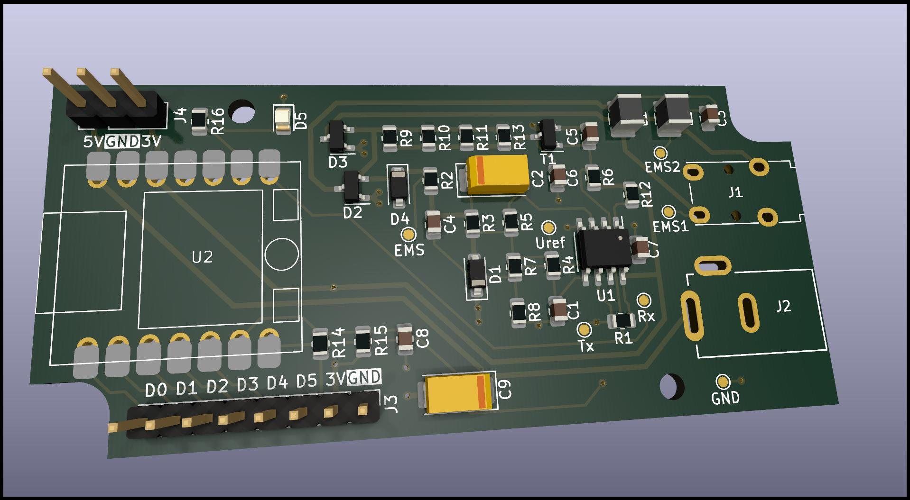

# EMS Bus Gateway for Buderus Boilers

This repository contains a schematic and PCB layout of an EMS Bus Gateway.
Essentially, it converts the voltage/current signals of the Buderus boilers EMS interface into 3.3V TTL levels.

The converted signals can then be fed into a $5 [Seeed Studio XIAO ESP32C3](https://www.seeedstudio.com/Seeed-XIAO-ESP32C3-p-5431.html),
which runs the [EMS-ESP32](https://github.com/mariusgreuel/EMS-ESP32) firmware.

The assembled EMS gateway can then be used to connect your home automation software to your Buderus devices.

The rendered image of the adapter looks like this:

## KiCad schematic and PCB

You can find the KiCad schematic and PCB layout files in the [PCB folder](./pcb).

## Gerber Files

If you just want to build an adapter yourself, you can use my [Gerber Plots](./ems-interface-gerber.zip) and send them to your favorite PCB manufacturer.

## License

The EMS Bus Gateway schematic and PCB layout is released under the GNU GPLv3.

Copyright 2023 Marius Greuel.
