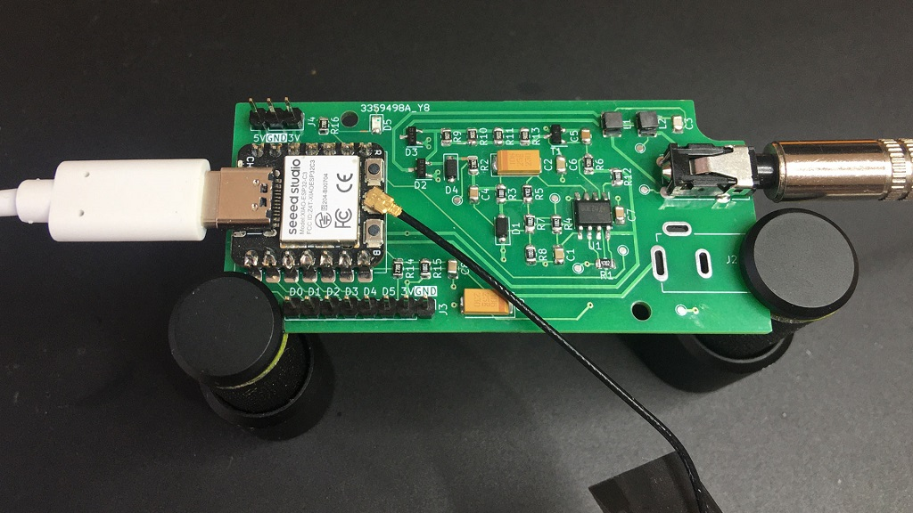
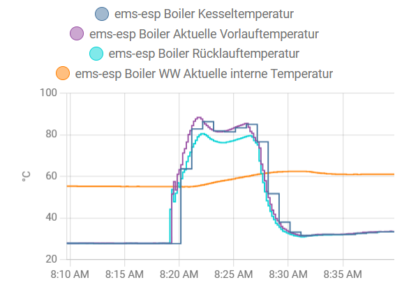
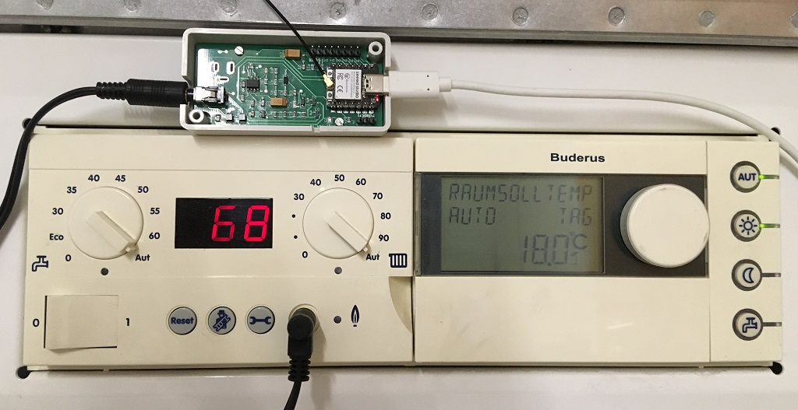
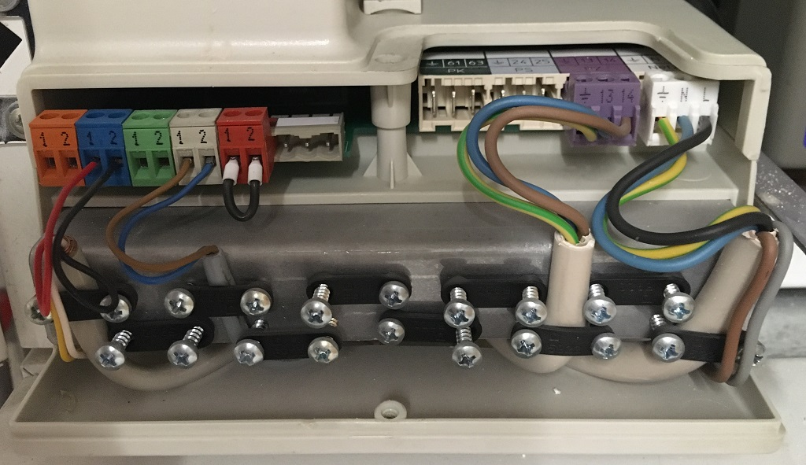

# EMS Bus Gateway

This repository contains a schematic and PCB layout of an **EMS Bus Gateway**. With the EMS Bus Gateway and the [EMS-ESP32](https://github.com/mariusgreuel/EMS-ESP32) firmware, you can connect EMS Bus devices, such as the **Buderus Logamax** boilers to your home automation system.

## Introduction

The assembled EMS Bus Gateway consists of three essential components:

- A voltage level converter that converts the EMS bus voltage levels to 3.3V TTL levels.
- A micro-controller.
- The EMS-ESP32 firmware.

The schematic uses a modified level convertor from the EMS reference schematic circulating the internet. For the micro-controller, a $5 [Seeed Studio XIAO ESP32C3](https://www.seeedstudio.com/Seeed-XIAO-ESP32C3-p-5431.html) board is used. You may also use a **Seeed Studio XIAO ESP32S3** instead. The micro-controller needs to be programmed with [EMS-ESP32](https://github.com/mariusgreuel/EMS-ESP32) firmware, which is capable of decoding the EMS bus protocol and broadcasting the EMS parameters into your network via MQTT. Finally, the assembled board may be fitted into a **Hammond 1551KGY** enclosure.

The assembled EMS Bus Gateway board looks like this:



## EMS Bus Background

Many Buderus devices, such as the **Buderus Logamax plus GB132 T** boiler, use a bus system called **EMS (Energy Management System)** to communicate with other devices, such as the RC30 room controller. The EMS bus is a simple two-wire serial bus that uses voltage/current modulation to transmit data. With the proper hardware and software, you can transmit many parameters of your boiler into your home automation system.

For instance, you could use [Home Assistant](https://www.home-assistant.io/) to monitor the temperatures of your boiler. Here is a screenshot showing the relevant boiler temperatures during a 10 minutes heating interval:



## Build the EMS-ESP32 firmware

To build the EMS-ESP32 firmware, we use the **PlatformIO** toolchain. Please refer to the [PlatformIO documentation](https://docs.platformio.org/en/latest/) on how to install and use **PlatformIO**. According to the original author of the EMS-ESP32 firmware, your should build the firmware on Linux.

Instead of building the firmware locally, you may download pre-built binaries from my [EMS-ESP32 Releases](https://github.com/mariusgreuel/EMS-ESP32/releases).

To setup the **PlatformIO** toolchain, run the following commands in a Linux bash:

```bash
sudo apt install python3
python3 -m venv ~/.venv/ems-esp32
source ~/.venv/ems-esp32/bin/activate
curl -o- https://raw.githubusercontent.com/nvm-sh/nvm/v0.39.5/install.sh | bash
pip install platformio
pip install esptool
nvm install 18
npm install --global yarn
git clone https://github.com/mariusgreuel/ems-esp32.git -b xiao ~/repos/ems-esp32
```

To build the EMS-ESP32 firmware for a **XIAO ESP32C3**, run the following command:

```bash
source ~/.venv/ems-esp32/bin/activate
nvm use 18
cd ~/repos/ems-esp32
git clean -xdf
platformio run -e seeed_xiao_esp32c3
```

To flash the EMS-ESP32 firmware on a **XIAO ESP32S3**, run the following command:

```bash
source ~/.venv/ems-esp32/bin/activate
nvm use 18
cd ~/repos/ems-esp32
git clean -xdf
platformio run -e seeed_xiao_esp32s3
```

After the build is completed, you will find the binaries in the `.pio\build\seeed_xiao_esp32c3` or `.pio\build\seeed_xiao_esp32s3` folder.

## Flash the EMS-ESP32 firmware

To flash the EMS-ESP32 firmware on the XIAO ESP32, we use the **esptool.py** from Espressif. Please refer to the [Espressif documentation](https://docs.espressif.com/projects/esptool/en/latest/esp32/esptool/index.html) on how to install and use **esptool.py**.

To flash the EMS-ESP32 firmware on a **XIAO ESP32C3**, run the following command:

```bash
esptool.py --chip esp32c3 --port /dev/ttyUSB0 --baud 460800 --before=default_reset --after=hard_reset write_flash 0x0 bootloader.bin 0x8000 partitions.bin 0x10000 firmware.bin
```

To flash the EMS-ESP32 firmware on a **XIAO ESP32S3**, run the following command:

```bash
esptool.py --chip esp32s3 --port /dev/ttyUSB0 --baud 460800 --before=default_reset --after=hard_reset write_flash 0x0 bootloader.bin 0x8000 partitions.bin 0x10000 firmware.bin
```

## Configure the EMS-ESP32 software

> Note: The documentation below is a quick-start guide to setup the EMS gateway. For detailed instructions, refer to the original documentation at <https://emsesp.github.io/docs/>.

After you have flashed the XIAO ESP32, your need to configure the EMS-ESP32 software to connect it to your local WiFi network. Essentially, the EMS-ESP32 software creates a local WiFi access point that you can connect to. Then, you can open the dashboard of the EMS-ESP32 software using a web browser via a pre-defined username and password and connect the XIAO ESP32 to your local WiFi network:

- Connect the WSP to a USB-C power supply.
- Connect to the new WiFi access point **ems-esp** using the WPA password **ems-esp-neo**.
- Open the URL <http://ems-esp.local/> in a web browser.
- Enter the username **admin** and the password **admin**.

I recommend making the following configuration changes:

- Under **Settings**, set **Board profile** to **Seeed Studio XIAO ESP32C3**.
- Under **Network/Network Settings**, enter the SSID and password of your local WiFi network.
- Under **Access Point/Access Point Settings**, set **Enable Access Point** to **Never**. Before you disable the access point ensure that your EMS Bus gateway has successfully connected to your local WiFi network.
- Under **NTP/NTP Settings**, check **Enable NTP**.
- Under **MQTT/MQTT Settings**, enable MQTT, enter the IP address of your MQTT broker, and enter your MQTT broker credentials. If you run Home Assistant, check **Enable MQTT Discovery**, and set **Discovery Type** to **Home Assistant**.
- Under **Security**, create a new admin user and remove the pre-defined accounts.

As the EMS Bus Gateway is capable of manipulating the settings of your boiler and issuing arbitrary commands, I recommend putting the EMS gateway into **read-only mode**.

> WARNING: If you choose to not enable **read-only mode**, be advised that it is possible to issue powerful commands such starting up the heater of your boiler, which may potentially damage your boiler.

- Under **Settings**, check **Enable read-only mode**.

## Connect the EMS Bus Gateway to your boiler

To connect the EMS Bus Gateway to your boiler, first connect a USB power supply to the USB-C port of the XIAO ESP32. The XIAO ESP32 requires a power supply of 5V. Refer to the [XIAO ESP32C3 documentation](https://wiki.seeedstudio.com/XIAO_ESP32C3_Getting_Started/) for details.

To connect the gateway to the boiler, you can use a 3.5mm TRS audio cable to connect the connector of the EMS Bus Gateway to the service port of your boiler.

The pinout of the TRS service port connector and the EMS Bus Gateway connector is as follows:


Here is a picture of a Buderus Logamax plus GB132T Boiler with a RC30 controller.



Instead of using the service port connector, you can connect a cable directly to the EMS front panel connector of your boiler. In this picture, the left orange/brown connector named **RC** (room controller) may be used. Refer to your boilers service manual for details. The polarity of this connector does not matter.



## Other documents in this repository

- [EMS Bus Gateway Rendering](./docs/ems-bus-gateway-rendering.jpg)
- [EMS Bus Gateway Schematic (PDF))](./docs/ems-bus-gateway-schematic.pdf)
- [EMS Bus Gateway Component Layout (PDF))](./docs/ems-bus-gateway-component-layout.pdf)
- [EMS Bus Gateway Component List (PDF))](./docs/ems-bus-gateway-component-list.pdf)
- [EMS Bus Gateway Gerber Files](./docs/ems-bus-gateway-gerber.zip)
- [EMS Bus Gateway KiCad project](./pcb)

## References

- EMS-ESP Firmware (EMS Bus Gateway Fork): <https://github.com/mariusgreuel/EMS-ESP32>
- EMS-ESP Firmware (Original): <https://github.com/emsesp/EMS-ESP32>
- EMS-ESP Firmware Documentation: <https://emsesp.github.io/docs/>
- Seeed Studio XIAO Documentation: <https://wiki.seeedstudio.com/SeeedStudio_XIAO_Series_Introduction/>

## License

The EMS Bus Gateway schematic, PCB layout, and documentation is released under the GNU GPLv3.

Copyright 2023 Marius Greuel.
